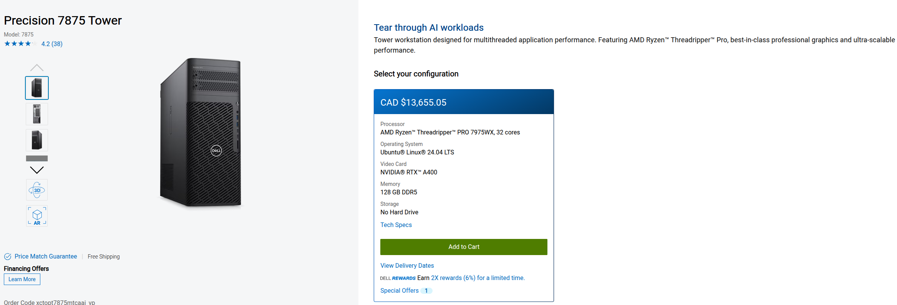
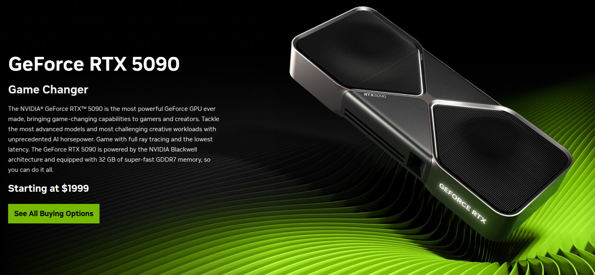

# PC Build to run 120B LLMs

## DELL Precision T7875 with 2× NVIDIA RTX 5090 GPUs** 

Product Links: 

1. [Dell Precision T7875](https://www.dell.com/en-ca/shop/cty/pdp/spd/precision-t7875-workstation)
1. [NVIDIA RTX 5090 GPU](https://www.nvidia.com/en-us/geforce/graphics-cards/50-series/rtx-5090/)

The configuration itself is enterprise-grade workstation class and it can handle:

* 20B–70B model inference
* Qwen/Qwen-Coder 30B/32B at high speed
* GPT-OSS 20B finetuning
* Multi-GPU training
* Future 120B inference with tensor/quantization + device_split

# **Why This Dell Precision T7875 Can Run 2× RTX 5090**

Your machine has the correct PCIe layout:

### **PCIe Slots**

* **1× PCIe Gen5 x16 (full bandwidth)**
  → Perfect for primary RTX 5090
* **1× PCIe Gen4 x16 (full bandwidth)**
  → Perfect for secondary RTX 5090

RTX 5090 uses:

* PCIe **Gen5** interface
* Requires **x16 electrical**
* Requires **350–450W power**

This chassis is designed for exactly this kind of load.

---

# **Power Delivery Support?**

The T7875 typically includes:

* **Up to a 2000W enterprise PSU**
* Server-grade power distribution
* Air shrouds for dual-GPU thermals

Dell explicitly certifies this chassis for dual-wide GPUs such as:

* RTX 6000 Ada
* RTX A6000
* RTX 5000 Ada
* Dual RTX 4090 in some configs

If it handles those, it will handle dual RTX 5090.

---

# **CPU Compatibility**

### **AMD Threadripper PRO 7975WX**

* **32 cores / 64 threads**
* **8-channel DDR5 ECC RDIMM memory**
* **PCIe 5.0 lanes for multiple GPUs**
* Massive bandwidth

This CPU is perfect for multi-GPU model training/inference because it can feed the GPUs without bottlenecking.

---

# 💾 **Memory Support**

**128 GB DDR5 ECC RDIMM (8 × 16GB)**

This workstation supports up to:

### **Up to 2 TB ECC RDIMM**

Can be upgraded later if needed for training LLMs up to the 70B range.

---

# 🧠 **What can you realistically run on this setup?**

## **With 1× RTX 5090 (32GB VRAM):**

* GPT-OSS 7B–20B fast
* Qwen/Qwen-Coder 14B fast
* Qwen-Coder 30B (quantized) good
* GPT-OSS 20B *fine-tuning* (QLoRA) OK

---

## **With 2× RTX 5090 (64GB combined VRAM):**

### **Inference**

* GPT-OSS 30B → *very fast*
* Qwen/Qwen-Coder 32B → smooth
* DeepSeek 67B Q4/Q5 → possible but slower
* GPT-OSS 120B → **EXPERIMENTAL but doable**

  * Requires tensor parallelism
  * Needs both GPUs
  * Quantized mode
  * And you may see 1–3 tok/s

So yes — future-proof enough for 120B inference.

### **Fine-Tuning**

You can reliably tune:

* GPT-OSS 20B (QLoRA or full-finetune with memory optimisation)
* GPT-OSS 30B (QLoRA only)
* Qwen 32B (QLoRA)
* DeepSeek 33B (QLoRA)

---

# ❗Important: Does Dell ship RTX 5090 options?

Right now:

* Dell *does not list* RTX 5090 because it’s a consumer card
* But the slot and power design **support it**
* You simply buy the GPUs yourself and install them manually

Dell T7xxx and T5xxx series are known for being compatible with:

* RTX 4090
* RTX 5090 (same size/power profiles—just new generation)

