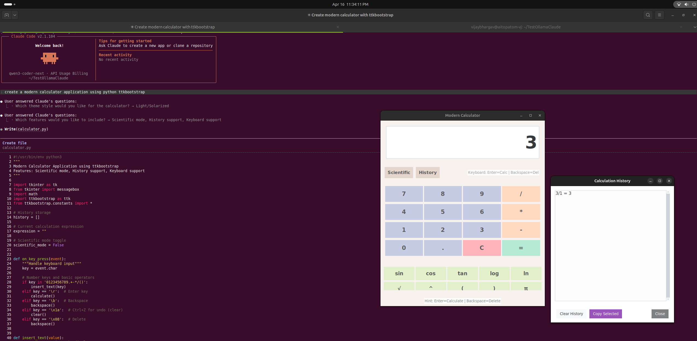

# Ollam - launch gemma4 with turboquant

## You can run the steps with any model. Choose coding model for claude code.

```bash

User@System:~$ ollama list
NAME             ID              SIZE      MODIFIED     
gemma4:latest    c6eb396dbd59    9.6 GB    11 hours ago    


User@System:~$ ollama show gemma4
  Model
    architecture        gemma4    
    parameters          8.0B      
    context length      131072    
    embedding length    2560      
    quantization        Q4_K_M    
    requires            0.20.0    

  Capabilities
    completion    
    vision        
    audio         
    tools         
    thinking      

  Parameters
    temperature    1       
    top_k          64      
    top_p          0.95    

  License
    Apache License               
    Version 2.0, January 2004    
    ...                          

User@System:~$ cd AI
User@System:~/AI$ nano Modelfile
```

> **Note** : Include the below lines into the Modelfile

```yml
FROM gemma4

PARAMETER num_ctx 4096
PARAMETER num_thread 8
```


```bash
User@System:~/AI$ ollama create gemma4-fast -f Modelfile
gathering model components 
using existing layer sha256:4c27e0f5b5adf02ac9g3584t5eut09jka0uhtj8565a8512c9aba5385242cb6e09a 
using existing layer sha256:7339fa418c9ad3e8e12e74ad0fd26a9dsget345trgsdgw4564u5ujerh5563be85cb2 
creating new layer sha256:dab92d47ryt4y57690708p090uph87dryt56466utrdr4602be45993442de4a535f6eb 
writing manifest 
success 


User@System:~/AI$ ollama run gemma4-fast
>>> hi
Thinking...
Thinking Process:

1.  **Analyze Input:** The user sent "hi". (A standard, friendly greeting).
2.  **Determine Goal:** The goal is to respond politely, naturally, and encouragingly, maintaining a helpful and conversational tone.
3.  **Craft Response:**
    *   Acknowledge the greeting (e.g., "Hi there!", "Hello!").
    *   Ask a welcoming follow-up question to initiate the interaction and prompt the user for their actual query (e.g., "How can I help you?", "What can I do for you today?").
4.  **Select Best Option:** A combination of a friendly greeting and a functional prompt works best. (e.g., "Hello! How can I help you today?")
...done thinking.

Hi! How can I help you today? 😊

>>> /bye
User@System:~/AI$ $ ollama launch claude --model gemma4-fast

Launching Claude Code with gemma4-fast...
Welcome to Claude Code v2.1.112
…………………………………………………………………………………………………………………………………………………………

     *                                       █████▓▓░
                                 *         ███▓░     ░░
            ░░░░░░                        ███▓░
    ░░░   ░░░░░░░░░░                      ███▓░
   ░░░░░░░░░░░░░░░░░░░    *                ██▓░░      ▓
                                             ░▓▓███▓▓░
 *                                 ░░░░
                                 ░░░░░░░░
                               ░░░░░░░░░░░░░░░░
       █████████                                        *
      ██▄█████▄██                        *
       █████████      *
…………………█ █   █ █………………………………………………………………………………………………………………

 Let's get started.

 Choose the text style that looks best with your terminal
 To change this later, run /theme

   1. Auto (match terminal)
 ❯ 2. Dark mode ✔
   3. Light mode
   4. Dark mode (colorblind-friendly)
   5. Light mode (colorblind-friendly)
   6. Dark mode (ANSI colors only)
   7. Light mode (ANSI colors only)

 ╌╌╌╌╌╌╌╌╌╌╌╌╌╌╌╌╌╌╌╌╌╌╌╌╌╌╌╌╌╌╌╌╌╌╌╌╌╌╌╌╌╌╌╌╌╌╌╌╌╌╌╌╌╌╌╌╌╌╌╌╌╌╌╌╌╌╌╌╌╌╌╌╌╌╌╌╌╌╌╌╌╌╌╌╌╌╌╌╌╌╌╌╌╌╌╌╌╌╌╌╌╌╌╌╌╌╌╌╌╌╌╌╌╌╌╌╌╌╌╌╌╌╌╌╌╌╌╌╌╌╌╌╌╌╌╌╌╌╌╌╌╌╌╌╌╌╌╌╌╌╌╌╌╌╌╌╌╌╌╌╌╌╌╌╌╌╌╌╌╌╌╌╌╌╌╌╌╌╌╌╌╌╌╌╌╌╌╌╌╌╌╌╌╌╌╌╌╌╌╌╌╌╌╌╌╌╌╌╌╌╌╌╌╌╌╌╌╌╌╌╌╌╌╌╌╌╌╌╌╌╌╌╌╌╌╌
  1  function greet() {
  2 -  console.log("Hello, World!");                                                                                                                                                                                                          
  2 +  console.log("Hello, Claude!");                                                                                                                                                                                                         
  3  }


```


