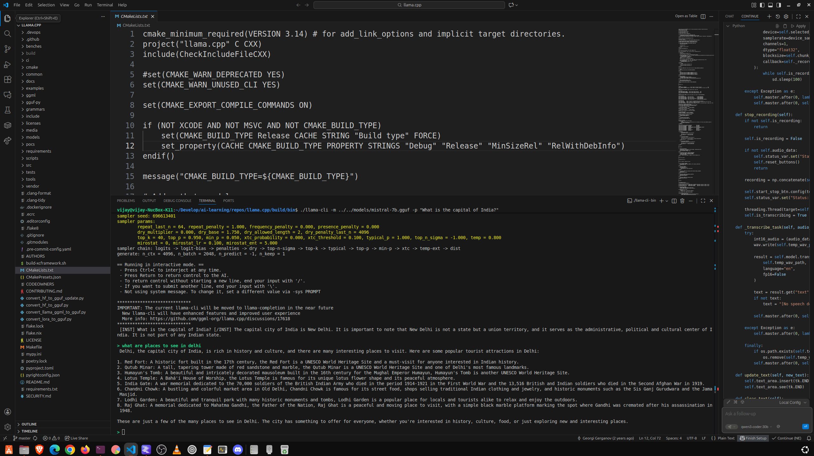

# 🚀 Complete llama.cpp Setup & Build Guide for Ubuntu

This guide assumes you are starting with a fresh Ubuntu installation and need to use **Homebrew (Linuxbrew)** to manage development dependencies like `cmake` and `gcc`.

## Step 1: Install System Prerequisites (Ubuntu's Package Manager)

First, install the fundamental tools needed for all development tasks, including Git and the core compilation toolchain (`build-essential`).

```bash
# 1. Update package lists
sudo apt update

# 2. Install core development tools, file/curl utilities, and git
sudo apt install build-essential procps curl file git
```

## Step 2: Install and Configure Homebrew (Linuxbrew)

Because you opted to use Homebrew, we'll install and configure it to manage the specific development packages required by `llama.cpp`.

### A. Run the Homebrew Installation Script

Run the official Homebrew installation script. You will be prompted to press `ENTER` to continue and enter your password for `sudo` access.

```bash
/bin/bash -c "$(curl -fsSL https://raw.githubusercontent.com/Homebrew/install/HEAD/install.sh)"
```

### B. Configure Homebrew in Your PATH

After the installation succeeds, you **must** run the following three commands to make the `brew` command and all packages it installs available in your terminal. This is the fix for the **`... is not in your PATH`** warning.

```bash
echo 'eval "$(/home/linuxbrew/.linuxbrew/bin/brew shellenv)"' >> ~/.bashrc
eval "$(/home/linuxbrew/.linuxbrew/bin/brew shellenv)"
```

-----

## Step 3: Install Core Dependencies (Homebrew)

Now that Homebrew is active, we use it to install the **C++ compiler (GCC)**, the **build system (CMake)**, and the **model download client library (cURL)**. These packages were the source of your initial errors (`Could NOT find CMake`, `Could NOT find CURL`).

```bash
# 1. Install the latest GCC compiler (required for C/C++ compilation)
brew install gcc

# 2. Install CMake (the build system generator)
brew install cmake

# 3. Install cURL development libraries (fixes the 'Could NOT find CURL' error)
brew install curl
```

-----

## Step 4: Clone the `llama.cpp` Repository

Use Git to download the source code for the project.

```bash
# Clone the repository
git clone https://github.com/ggerganov/llama.cpp.git

# Navigate into the project directory
cd llama.cpp
```

-----

## Step 5: Build `llama.cpp` with CMake

The CMake process is split into two parts: configuration and compilation. We use a dedicated `build` subdirectory to keep the source directory clean.

1.  **Create the build directory:**

    ```bash
    mkdir build
    cd build
    ```

2.  **Configure the build:**
    The `cmake ..` command checks for all dependencies (`gcc`, `cmake`, `curl`) and generates the necessary build files (Makefiles). Since you installed all dependencies in the previous steps, this should now succeed.

    ```bash
    cmake ..
    ```

3.  **Compile the code:**
    The `make` command compiles the project. The `-j$(nproc)` flag tells `make` to use all available CPU cores, which significantly speeds up the compilation process.

    ```bash
    make -j$(nproc)
    ```

### ✅ Successful Build Verification

After the compilation finishes, the core binaries (like `llama-cli`, `quantize`, and `perplexity`) will be located in the **`build/bin`** directory.

## Step 6: Running Your First Model

### A. Download a GGUF Model

You need a model in the modern **GGUF** format. Many great models are available from **TheBloke** on Hugging Face. For example, a small, fast model like Mistral 7B (Q4\_K\_M quantization) is a great starting point.

```bash
# Create a dedicated directory for your models
mkdir -p ../models
cd ../models

# Example: Download a popular small model (replace URL as needed)
curl -L 'https://huggingface.co/TheBloke/Mistral-7B-Instruct-v0.2-GGUF/resolve/main/mistral-7b-instruct-v0.2.Q4_K_M.gguf' -o mistral-7b.gguf
```

### B. Run the Model

Navigate back to the binaries directory and run the model with a simple prompt.

```bash
cd ../build/bin

# Replace mistral-7b.gguf with the actual filename if you downloaded a different one
./llama-cli -m ../../models/mistral-7b.gguf -p "What is the capital of India?"
./llama-cli -m ../../models/mistral-7b.gguf -p "What is the capital of Canada?"
```

This completes the full setup and build process, resolving all the prerequisite issues encountered.




# Reuse LM studio model downloads

**GGUF** (GGML Universal File Format) is the model file format used by both **LM Studio** and **`llama.cpp`**, which is why they are often referred to as "interoperable."

All you need to do is locate the folder where LM Studio stores its models and copy or point `llama.cpp` to the specific `.gguf` file you want to use.

## How to Use LM Studio GGUF Models with `llama.cpp`

The main challenge is finding where LM Studio hides its downloaded models on your system.

### Step 1: Find the Model Location

LM Studio typically stores models in a hidden directory.

1.  **Open LM Studio.**
2.  Go to the **"My Models"** tab (usually the second icon on the left sidebar).
3.  Click on a downloaded model. You should see a section or button that shows the **Model Path**.
4.  Copy this **full directory path**.

The path on Linux/Ubuntu is usually something like this:

```
/home/user1/.cache/lm-studio/models/
```

Inside this folder, you will find subdirectories named after the model creator and model, and within those, the actual `.gguf` files.

### Step 2: Copy the Model File

Navigate to the location you found in Step 1 and copy the desired `.gguf` file to your `llama.cpp/models` directory.

Assuming your model is at the default location and you named the file `my_lm_studio_model.gguf`:

```bash
# 1. Navigate to your llama.cpp models folder
cd /path/to/your/llama.cpp/models

# 2. Copy the model file from the LM Studio cache
# (You will need to replace the example path below with the exact path you found)
cp /home/user1/.cache/lm-studio/models/SomeUser/ModelName/my_lm_studio_model.gguf .
```

### Step 3: Run the Model with `llama-cli`

Once the model is in your `llama.cpp/models` folder (or you use the full path), you can run it using the `llama-cli` binary you just built.

```bash
# 1. Navigate to the compiled binaries
cd /path/to/your/llama.cpp/build/bin

# 2. Run the model
./llama-cli -m ../../models/my_lm_studio_model.gguf -p "What are the three most important facts about the Roman Empire?"
```

This command loads the model and uses it to process the prompt, confirming that the files are fully interchangeable between LM Studio and the raw `llama.cpp` binary.


## use a **symbolic link** (symlink) instead of copying the model file

A symbolic link is essentially a pointer or shortcut. When `llama.cpp` attempts to open the symlink, the operating system transparently directs it to the actual model file in the LM Studio cache, even though the file appears to be in your `llama.cpp/models` folder.

Here is the process:

### 1\. Locate the Model's Actual Path

First, you need the full, definitive path to the model file inside the LM Studio cache.

  * **Example LM Studio Path (Source):** `/home/user1/.cache/lm-studio/models/TheBloke/Llama-3-8B-Instruct-GGUF/llama-3-8b-instruct.Q4_K_M.gguf`

### 2\. Create the Symbolic Link

Use the `ln -s` command to create the link. You should execute this command from a convenient location, like your `llama.cpp/models` directory.

**Syntax:** `ln -s <TARGET_FILE_PATH> <LINK_NAME>`

Assuming your `llama.cpp` directory is at `~/Develop/ai-learning/repos/llama.cpp`:

```bash
# 1. Navigate to your models directory
cd ~/Develop/ai-learning/repos/llama.cpp/models

# 2. Create the symbolic link
# REPLACE the path in single quotes with the actual path to your LM Studio model.
ln -s '/home/user1/.cache/lm-studio/models/TheBloke/Llama-3-8B-Instruct-GGUF/llama-3-8b-instruct.Q4_K_M.gguf' llama-3.gguf
```

In the example above:

  * `llama-3-8b-instruct.Q4_K_M.gguf` is the **Target** (the real file).
  * `llama-3.gguf` is the **Link Name** (the shortcut name you will use).

### 3\. Run `llama-cli` using the Link Name

Now, you can use the short, simple link name (`llama-3.gguf`) in your `llama-cli` command. The paths you need to use remain the same, as the link acts just like the file itself.

Assuming you are in the `build/bin/` directory:

```bash
# Use the link name, which is inside the ../../models folder
./llama-cli -m ../../models/llama-3.gguf -p "Write a short poem about coding."
```

This command will successfully load the model from the linked file, without taking up double the disk space.


# Build your interface on the top

You can build a sophisticated **ttkbootstrap** (Tkinter) application to interact with `llama.cpp` and implement all those features.

The key to success is using the dedicated **`llama-server`** (or the Python binding) to handle the long-running model process, combined with **Python's threading** or **asynchronous I/O** (like `asyncio`) in your GUI application to keep the UI responsive.

Here is the breakdown of the recommended architecture and how to achieve each feature:

-----

## 1\. Recommended Architecture: `llama-cpp-python`

Instead of running the command-line binary (`llama-cli` or `llama-server`) as a separate subprocess, the most robust and performant approach for Python is to use the official **`llama-cpp-python`** library.

This package is a **Python binding** (wrapper) for the `llama.cpp` C++ library, which allows you to load and run GGUF models directly within your Python code.

### ⚙️ How to Connect (Direct Binding)

1.  **Install the library:**
    ```bash
    # This compiles llama.cpp and installs the Python bindings
    pip install llama-cpp-python
    ```
2.  **Run the model inside your Python code:**
    ```python
    from llama_cpp import Llama

    # Load your model (using the path from your successful run)
    llm = Llama(
        model_path="../../models/mistral-7b.gguf", # Corrected path to the GGUF file
        n_ctx=4096, # Set a large context window for conversation history
        n_gpu_layers=-1 # Use all GPU layers if you have VRAM
    )

    # Generate a response
    output = llm("Q: Tell me a joke. A:", max_tokens=100)
    ```

-----

## 2\. Implementing Core Features in Your ttkbootstrap App

### ✅ Run Commands in the Background & Update UI

Since model generation is a long-running, blocking task, you **must** run it in a separate thread to prevent your Tkinter UI from freezing (hanging).

| Feature | Method | Explanation |
| :--- | :--- | :--- |
| **Background Task** | **`threading.Thread`** | Wrap the model call (`llm.create_completion` or API call) in a separate thread. This keeps the main Tkinter thread free to update the GUI. |
| **UI Update** | **`root.after()`** | The separate thread **cannot** directly update Tkinter widgets. Instead, the thread should put its results (text chunks or the final response) into a thread-safe **`queue.Queue`** object. The main Tkinter loop uses the `root.after()` method to periodically check the queue for new data and safely update the text box. |

### ✅ Keep History of Conversations (Chat History)

`llama.cpp` models maintain history by passing the entire conversation (turns) back to the model for every new query.

1.  **Store History:** Maintain a Python list of dictionaries in your application, formatted according to the **Chat Markup Language (ChatML)** template your GGUF model uses (e.g., Mistral uses `[INST]` and `[/INST]`).
    ```python
    conversation_history = [
        {"role": "system", "content": "You are a helpful assistant."},
        {"role": "user", "content": "Hello! What is your name?"},
        {"role": "assistant", "content": "I am an AI, I do not have a name."}
    ]
    ```
2.  **Generate Prompt:** Before each call to the LLM, format this list into a single long string (the full context) and pass it to the model. The model reads the entire history and generates the next response.
3.  **Update History:** Once the response is generated, append the new user query and the new model response to the `conversation_history` list.

### ✅ Attach Files to the Context (RAG)

The process of "attaching files" to the context is called **Retrieval-Augmented Generation (RAG)**. This is a multi-step process that you will need to implement using another library, such as **LangChain** or **LlamaIndex**, which integrates seamlessly with `llama-cpp-python`.

| Component | Function |
| :--- | :--- |
| **Documents** | The files (PDF, TXT, DOCX) you upload. |
| **Embedding Model** | A small, fast GGUF model (often a different one) used to convert the text chunks and your user query into **vector embeddings** (numerical representations). |
| **Vector Store** | A database (like ChromaDB or FAISS) that stores the vector embeddings of your document chunks. |
| **Retrieval** | When the user asks a question, LangChain/LlamaIndex uses the query embedding to search the Vector Store and retrieve the most **semantically relevant text chunks** from your documents. |
| **Augmentation** | The retrieved text chunks are combined with the original user query into a single, massive prompt, which is then sent to your main GGUF model (`mistral-7b.gguf`) for context-aware answering. |