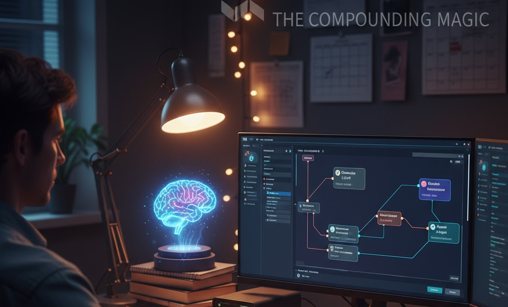

# Learn Small But Continue without a Break.

## The Compounding Magic: How Small Weekly Efforts Unlock Unimaginable Futures

We live in a world obsessed with instant gratification and monumental achievements. We see headlines of overnight successes, groundbreaking innovations, and meteoric rises. This constant deluge can make the idea of "learning a little bit each week" feel insignificant, almost quaint. But beneath the surface of this small, consistent effort lies a profound, transformative power—a magic that, over time, can unlock capabilities and opportunities far beyond what we initially imagine.

Imagine dedicating just a few hours each week to something new: a programming language, the fundamentals of AI, a musical instrument, a new language, or even a complex craft. Individually, these weekly sessions might seem minor. You might only grasp a new concept, fix a small bug, learn a new chord, or memorize a handful of words. The immediate "result" is often imperceptible.

### The Power of Compounding Knowledge

However, this isn't about immediate results; it's about the **compounding effect of knowledge**. Each small piece of information, each new skill acquired, acts like a tiny building block. Initially, these blocks might seem disparate, like scattered pebbles on a beach. But with consistent effort, they begin to connect, form patterns, and eventually construct intricate structures.

A few lines of code learned today might seem trivial, but combine it with next week's lesson on data structures, and the week after's introduction to APIs, and suddenly you can build a simple script. Keep going, and that script evolves into a small application. Maintain that curiosity and dedication, and that small application could become a tool that automates a tedious part of your job, or even spark an idea for a startup.

The same applies to AI. Understanding the basics of a neural network this month, then exploring large language models next month, and then delving into reinforcement learning, builds a comprehensive mental model. You begin to see connections, patterns, and possibilities that were entirely invisible when you started. You're not just learning facts; you're developing intuition, problem-solving abilities, and a unique perspective that only comes from deep, iterative engagement.

**The "unimaginable things" aren't usually grand, pre-planned destinations. They are emergent properties, serendipitous discoveries that arise from a rich tapestry of accumulated knowledge and skills.**

### The Joy of Learning: Your True North

This brings us to a crucial point: **the primary motivation for learning should be the sheer joy of it.** The intrinsic pleasure of understanding something new, of solving a puzzle, of seeing a concept click into place. This is your most sustainable fuel.

When you learn for the sake of learning, you are free. You are not shackled by external expectations or the pressure of an immediate payoff. This freedom allows for:

1.  **Genuine Curiosity:** You follow interesting threads, even if they don't seem immediately "useful." This is where true innovation often happens.
2.  **Deeper Engagement:** When you're genuinely enjoying the process, you're more likely to persist through challenges and spend more time immersed in the subject.
3.  **Resilience:** Setbacks become less discouraging because the journey itself is rewarding, not just the destination.

### Why "Eyes on Results and Returns" Is Super Distracting

Conversely, fixating on immediate results, financial returns, or tangible outcomes can be profoundly distracting and even detrimental to this long-term growth. Here's why:

* **Discouragement from Slow Progress:** True learning, especially in complex fields like programming or AI, is often slow and incremental. If you're constantly looking for a grand payoff, the small, consistent efforts will feel insufficient, leading to demotivation and burnout.
* **Narrowed Focus:** An obsession with results can make you myopic. You might only learn what you perceive as directly relevant to your immediate goal, missing out on tangential but ultimately crucial insights or foundational knowledge that could lead to even greater breakthroughs down the line.
* **Missed Serendipity:** Many great discoveries and personal transformations come from unexpected places. When you're rigidly focused on a specific outcome, you close yourself off to these fortunate accidents and emergent opportunities.
* **Pressure and Anxiety:** Learning under the constant pressure to "deliver" or "monetize" drains the joy out of the process, making it feel like a chore rather than an exploration. This can hinder creativity and problem-solving abilities.
* **Short-Term Thinking:** Chasing quick returns often leads to superficial learning. You might learn enough to achieve a basic task but lack the deep understanding required for true mastery, adaptability, and innovation.

### Embrace the Journey, Trust the Process

So, if you're looking to truly transform your capabilities and open doors to unimaginable futures, shift your focus. Embrace the consistent, even tiny, acts of learning. Enjoy the process of discovery, the thrill of understanding. Trust that by continually adding those small building blocks, by nurturing your curiosity, you are constructing a future that will far exceed any specific outcome you could have initially envisioned.

Let the joy of learning be your guide, and watch in amazement as the magic of compounding knowledge unfolds before you. 
